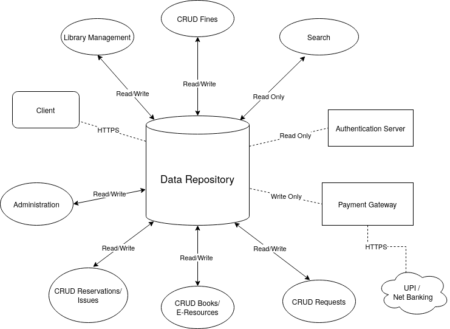
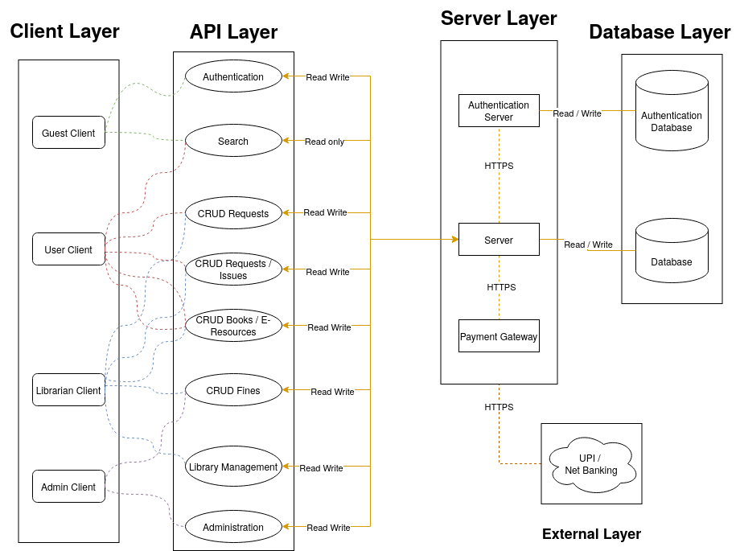
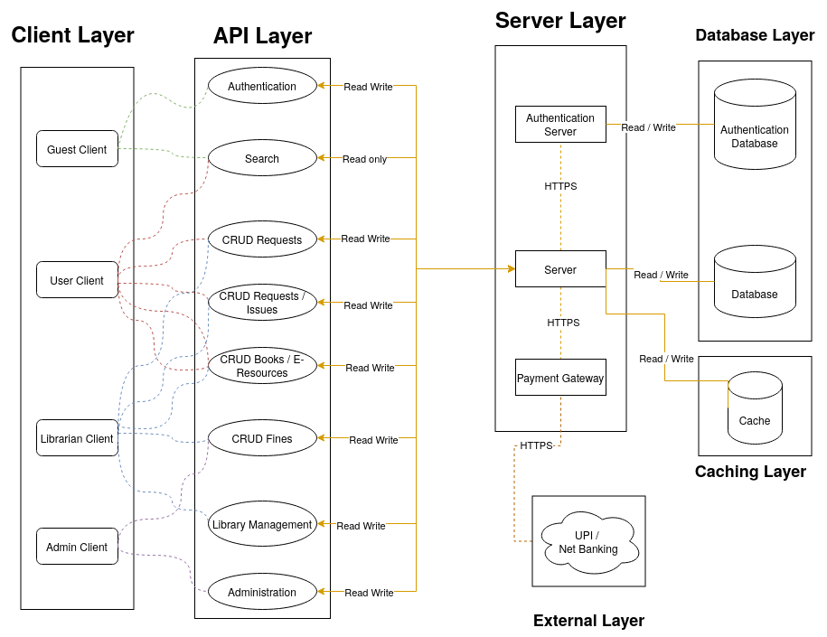

# Index

- [Index](#index)
- [Overview](#overview)
  - [Purpose](#purpose)
  - [Context](#context)
  - [Scope](#scope)
- [Architecture Design](#architecture-design)
  - [Architecture 1: Shared Data Architecture](#architecture-1-shared-data-architecture)
  - [Architecture 2: Client Server Architecture](#architecture-2-client-server-architecture)
  - [Architecture 2.1: Client Server Architecture with Caching Layer](#architecture-21-client-server-architecture-with-caching-layer)
  - [Comparison of Architectures](#comparison-of-architectures)
    - [Performance](#performance)
    - [Supportability/ Maintainability](#supportability-maintainability)
    - [Scalability](#scalability)
    - [Security](#security)
    - [Code adaptability](#code-adaptability)
    - [Debugging Time](#debugging-time)
    - [Code Duplication](#code-duplication)
    - [Code complexity](#code-complexity)
  - [Design Rationale](#design-rationale)
- [Appendix](#appendix)
  - [Definitions, Acronyms, and Abbreviations](#definitions-acronyms-and-abbreviations)
  - [References](#references)

\newpage

# Overview

## Purpose

The purpose of this document is to provide a detailed description of the architecture to be used for the Library Management System application. The architecture proposed will be used to guide the development of the system and to provide a blueprint for the system's design and implementation.

## Context

The Library Management System will be a standalone system that will be used by the library of a university. It will be used to manage the books, journals, e-resources, members and fines of the library. It will also be used to manage the issues, returns, reservations and requests of the library.

## Scope

The system will be used by the following stakeholders:

- Librarian
- Administrator
- Faculty
- Students

The system will manage the following:

- Books and book copies
- E-Resources and Journals
- Members of the library
- Fines
- Book issues, returns, reservations and requests

\newpage

# Architecture Design

In the following architectures, the connectors used are:

| Connector  | Connector Type                | Description                                    |
| ---------- | ----------------------------- | ---------------------------------------------- |
| Read only  | Database Access               | Used to read data from the database            |
| Write only | Database Modification         | Used to write data to the database             |
| Read/Write | Database Access, Modification | Used to read and write data to the database    |
| HTTP       | Network(HTTP)                 | Used to send and receive data over the network |
| Control    | Procedure Call                | Used to call a procedure in the server         |

The components used are:

| Component                  | Type                               | Description                                                     |
| -------------------------- | ---------------------------------- | --------------------------------------------------------------- |
| Client                     | User Interface                     | Front end that interacts with the user                          |
| Data Repository            | Database                           | Stores and retrieves data                                       |
| Administrator              | Processing (Database Modification) | Help admin to manage the system                                 |
| Librarian                  | Processing (Database Modification) | Help librarian to manage the system                             |
| Search                     | Processing (Database Access)       | Used to search for books and e-resources                        |
| CRUD Books / E-Resources   | Processing (Database Modification) | Create, Read, Update, Delete books and e-resources              |
| CRUD Requests              | Processing (Database Modification) | Create, Read, Update, Delete requests                           |
| CRUD Reservations / Issues | Processing (Database Modification) | Create, Read, Update, Delete reservations and issues            |
| CRUD Fines                 | Processing (Database Modification) | Create, Read, Update, Delete fines                              |
| Payment Gateway            | Network(HTTP)                      | Used to process payments                                        |
| Authentication Server      | Processing (Database Access)       | Used to authenticate users                                      |
| Cache                      | Database                           | Stores frequently accessed data                                 |
| Server                     | Processing (Database Modification) | Back end that processes the user input and generates the output |

\newpage

## Architecture 1: Shared Data Architecture

The **database** centric architecture is a simple and straightforward architecture in which the database is the central component of the system.
The **client** interacts with the database directly to perform operations related to **data**.
The database is responsible for processing the user input and generating the output.
The client is responsible for displaying the output to the user and processing the user input.

Considering the above architecture, **except for the cache and server component**, all other components are present in this architecture.

\newpage

## Architecture 2: Client Server Architecture

The **client** **server** architecture is a straight forward architecture in which the **client** and **server** are separate components that communicate with each other over a network.
The **server** is responsible for processing the user input and generating the output.
The **client** is responsible for displaying the output to the user and sending the user input to the server.
The **server** also interacts with the **database** to fetch and store data.

Considering the above architecture, **except for the cache component**, all other components are present in this architecture.

\newpage

## Architecture 2.1: Client Server Architecture with Caching Layer

The **client** **server** architecture with a **caching** layer is a variation of the client server architecture in which a **caching** layer is added between the **server** and the **database**.

The **caching** layer is responsible for storing frequently accessed data and serving it to the server.
The **server** interacts with the **caching** layer to fetch and store data.

Most of the functions are similar to the client server architecture, except for the addition of the **caching** layer and the interaction between the **server** and the **caching** layer.

All components mentioned above are present in this architecture.

\newpage

## Comparison of Architectures

We use the ATAM (Architecture Tradeoff Analysis Method) to compare the above three architectures.

### Performance

Between the three architectures, the client server architecture with a caching layer provides the best performance. The caching layer stores frequently accessed data and serves it to the server, which reduces the load on the database and improves the performance of the system.

Between the other two architectures, the client server architecture provides better performance than the database centric architecture. The client server architecture allows the server to process the user input and generate the output, which reduces the load on the database and also allows the server to parallelize the processing of user input.

The database centric architecture provides the worst performance among the three. The database is the central component of the system and is responsible for processing the user input and generating the output, which makes it difficult to parallelize the processing of user input and also increases the load on the database.

### Supportability/ Maintainability

The client server architecture is the most maintainable architecture among the three. The client server architecture separates the client and server components, which makes it easier to maintain and update the system. The client server architecture also allows the server to be scaled independently of the client, which makes it easier to maintain and update the system.

The client server architecture with a caching layer is less maintainable than the client server architecture. The caching layer increases the complexity of the system and also introduces a new component that needs to be maintained and updated.

The database centric architecture is the least maintainable architecture among the three. The database is the central component of the system and is responsible for processing the user input and generating the output, which makes it difficult to maintain and update the system.

### Scalability

The client server architecture with a caching layer is the most scalable architecture among the three. The caching layer stores frequently accessed data and serves it to the server, which reduces the load on the database and allows the system to handle a growing amount of work.

The client server architecture is more scalable than the database centric architecture. The client server architecture allows the server to be scaled independently of the client, which makes it easier to handle a growing amount of work.

Trying to scale the database centric architecture is difficult because the database is the central component of the system and is responsible for processing the user input and generating the output.

### Security

The database centric architecture is less secure than the other two architectures since the client interacts with the database directly. This makes it easier for unauthorized users to access the database and perform unauthorized operations.

The client server architecture with a caching layer is a bit less secure than the client server architecture since the caching layer introduces a new component that needs to be secured.

### Code adaptability

The client server architecture is the most adaptable among the three. The client server architecture separates the client and server components, which makes it easier to adapt the system to new requirements.

The client server architecture with a caching layer is less adaptable than the client server architecture. The caching layer introduces a new component that needs to be adapted to new requirements.

The database centric architecture is the least adaptable among the three. The database is the central component of the system and is responsible for processing the user input and generating the output, which makes it difficult to adapt the system to new requirements.

### Debugging Time

The client server architecture is the easiest to debug among the three. The client server architecture separates the client and server components, which makes it easier to isolate and debug issues.

The database centric architecture is less easy to debug than the client server architecture since the client interacts with the database directly. This makes it difficult to isolate and debug issues.

The client server architecture with a caching layer is less easy to debug than the client server architecture. The caching layer introduces a new component that needs to be debugged, which increases the complexity of the system.

### Code Duplication

The client server architecture has the least code duplication among the three. The client server architecture separates the client and server components, which reduces the amount of code duplication in the system.

### Code complexity

The client server architecture is the simplest architecture among the three. The client server architecture separates the client and server components, which makes it easier to understand and maintain the system.

The client server architecture with a caching layer is more complex than the client server architecture. The caching layer introduces a new component that needs to be understood and maintained, which increases the complexity of the system.

\newpage

## Design Rationale

To summarize the comparison of the three architectures:-

| Factor                          | SDA    | CSA  | CSL    |
| ------------------------------- | ------ | ---- | ------ |
| Performance                     | OK     | Good | Best   |
| Supportability/ Maintainability | Bad    | Good | OK     |
| Scalability                     | Bad    | Good | Best   |
| Security                        | Bad    | OK   | OK     |
| Code adaptability               | Bad    | Good | OK     |
| Debugging Time                  | High   | Low  | Medium |
| Code Duplication                | High   | Low  | Medium |
| Code complexity                 | Medium | Low  | Medium |

where SDA is Shared Data Architecture, CSA is Client Server Architecture and CSL is Client Server Architecture with Caching Layer.

Considering the factors mentioned in the comparison above, we have decided to go with the client server architecture.

While the caching layer in the second architecture provides better performance, it also increases the complexity of the system. The client server architecture is a simpler and more maintainable architecture that is well suited for the requirements of the Library Management System.

\newpage

# Appendix

## Definitions, Acronyms, and Abbreviations

- User: A person who interacts with the system.
- Client: The front end of the system that interacts with the user.
- Server: The back end of the system that is responsible for processing the user input and generating the output.
- Database: A separate component that is responsible for storing and retrieving data.
- Cache: A temporary storage area that stores frequently accessed data.
- Network: A collection of computers and other devices that are connected together to share resources and information.
- Scalability: The ability of a system to handle a growing amount of work.
- Maintainability: The ability of a system to be easily maintained and updated.
- Web Application: An application that is accessed from a web browser.
- Business Logic: The logic that is responsible for processing the user input and generating the output.
- URI: Uniform Resource Identifier
- ATAM: Architecture Tradeoff Analysis Method
- SDA: Shared Data Architecture
- CSA: Client Server Architecture
- CSL: Client Server Architecture with Caching Layer
- CRUD: Create, Read, Update, Delete
- R/W: Read/Write

## References

Note that the following links are clickable in the PDF version of this document.

- [Pankaj Jalote's book on Software Engineering](https://books.google.co.in/books?id=M-mhFtxaaskC&printsec=copyright&redir_esc=y#v=onepage&q&f=false)
