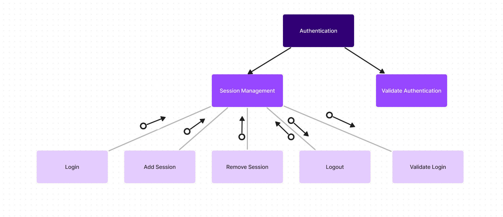
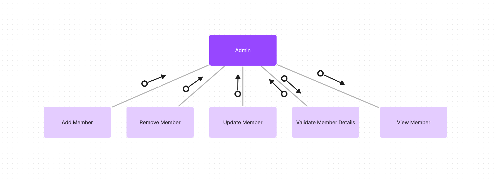

<!--

Submit a high-level design document for your software. Your report should contain the following sections:

Overview

2-3 paragraphs describing the goal of your software and an overall summary of the design document.

Data Flow Diagrams

- DFD for your system

Structured Charts

- First level factored modules
- Final structured chart showing all the modules

Design Analysis

- Name of all your final factored modules, its type (input, output, coordinate, etc), type of cohesion (functional, temporal, etc), estimated size of the module  (show in the form of a table)
- For each module, 1-2 sentences justifying the type of cohesion it has and also its degree of coupling with other modules.
- Count of total number of input, output, coordinate, transform and composite modules in your final structured chart. (show in the form of a table)
- Identify the most complex or error prone module in input, transformation and output subsystem. Also explain why you feel these modules are most complex or error prone.
- List the top-3 modules, along with counts, in terms of fan out and fan in?
Total expected size of your software in terms of LoC. Total LoC for input, transform and output subsystems.

Detailed Design Specification

- Interface of all the final level factored modules.
- Show it in the form of classes with attributes and methods.

-->

# Overview

## Context

The Library Management System is a software application that is designed to manage the operations of a library.

The system will:

- Provide a user-friendly interface for the library staff to manage the library resources, such as books, journals, and other e-resources.
- Provide a user interface for the library members to search for and borrow library resources.
- Automate the process of managing the library resources, including the cataloging, circulation, and inventory management.
- Provide reports and analytics to help the library staff to make informed decisions about the library operations.

## Purpose

The purpose of this document is to provide a detailed software design for the Library Management System.

The design proposed in this document is based on the requirements and specifications provided in the Software Requirements Specification (SRS) document.

The design will include the data flow diagram, structured charts, design analysis, and detailed design specifications.
This will serve as a guide for the development team to implement the system according to the requirements and specifications.

This document will be used as a reference for the development, testing, and maintenance of the Library Management System.

\newpage

# Data Flow Diagram

The data flow diagram (DFD) for the Library Management System is shown below.

This shows the flow of data between different components of the system. It also gives an overview of the inputs, outputs, and transformations in the system.

Here the DFD is divided into multiple parts, each part showing the data flow for either a user role, or a specific part of the system.


\newpage

{ height=375px }

Here, in the authentication part, the user can login, logout. Here, user-details and login details are the MAI and the status is the MAO.


Here, in the admin part, the admin can add, remove, or update the members of the library. Here "Member Details" is the MAI(Most abstract input) and the "Status" is the MAO(Most abstract output).

\newpage

# Data Types

Considering that the arguments to the functions are going to be objects of custom data-types, all custom data-types are defined below.

## Book Details

This custom data-type is used to store the details of a book.

```python

class bookdetails {
  bookId;
  title;
  author;
  publisher;
  ISBN;
  category;
  copies;
}

```

Thus, it has 7 attributes.

Here,

- `bookId` is the unique identifier for the book.
- `title` is the title of the book.
- `author` is the author of the book.
- `publisher` is the publisher of the book.
- `ISBN` is the International Standard Book Number of the book.
- `category` is the category of the book.
- `copies` is the number of copies of the book available in the library.

## E-Resource Details

This custom data-type is used to store the details of an e-resource.

```python

class eResourceDetails {
  eResourceId;
  title;
  author;
  publisher;
  URL;
  category;
}

```

Thus, it has 6 attributes.

Here,

- `eResourceId` is the unique identifier for the e-resource.
- `title` is the title of the e-resource.
- `author` is the author of the e-resource.
- `publisher` is the publisher of the e-resource.
- `URL` is the Uniform Resource Locator of the e-resource.
- `category` is the category of the e-resource.

## Member Details

This custom data-type is used to store the details of a member.

```python

class memberDetails {
  memberId;
  name;
  email;
  phone;
  address;
  membershipType;
}

```

Thus, it has 6 attributes.

Here,

- `memberId` is the unique identifier for the member.
- `name` is the name of the member.
- `email` is the email of the member.
- `phone` is the phone number of the member.
- `address` is the address of the member.
- `membershipType` is the type of membership of the member. It can be `student`, `faculty`, `librarian`, etc.

## Fine Details

This custom data-type is used to store the details of a fine.

```python

class fineDetails {
  fineId;
  memberId;
  amount;
  reason;
  date;
}

```

Thus, it has 5 attributes.

Here,

- `fineId` is the unique identifier for the fine.
- `memberId` is the unique identifier for the member.
- `amount` is the amount of the fine.
- `reason` is the reason for the fine.
- `date` is the date of the fine.

## Request Details

This custom data-type is used to store the details of a request.

```python

class requestDetails {
  requestId;
  memberId;
  bookId;
  date;
}

```

Thus, it has 4 attributes.

Here,

- `requestId` is the unique identifier for the request.
- `memberId` is the unique identifier for the member.
- `bookId` is the unique identifier for the book.
- `date` is the date of the request.

## Issue Details

This custom data-type is used to store the details of an issue.

```python

class issueDetails {
  issueId;
  bookId;
  memberId;
  dateOfIssue;
  dateOfReturn;
}

```

Thus, it has 5 attributes.

Here,

- `issueId` is the unique identifier for the issue.
- `bookId` is the unique identifier for the book.
- `memberId` is the unique identifier for the member.
- `dateOfIssue` is the date of issue of the book.
- `dateOfReturn` is the date of return of the book. Is null if the book is not returned.

## Statistics

This custom data-type is used to store the statistics of a member.

```python

class statistics {
  booksIssued;
  booksReturned;
  finesPaid;
  finesUnpaid;
  requestsMade;
  reservationsMade;
}

```

Thus, it has 6 attributes.

Here,

- `booksIssued` is the number of books issued to the member till date.
- `booksReturned` is the number of books returned by the member till date.
- `finesPaid` is the amount of fines paid by the member till date.
- `finesUnpaid` is the amount of fines unpaid by the member till date.
- `requestsMade` is the number of requests made by the member till date.
- `reservationsMade` is the number of reservations made by the member till date.

## Profile Details

This custom data-type is used to store the details of a member profile.

```python
class profileDetails {
  object memberDetails;
  object statistics;
}

```

Thus, it has 2 attributes, each made of 6 and 6 attributes respectively.

Here,

- `memberDetails` is the details of the member.
- `statistics` is the statistics of the member.

## Session Details

This custom data-type is used to store the details of a session of a user.

```python

class sessionDetails {
  sessionId;
  userId;
  loginTime;
  logoutTime;
}

```

Thus, it has 4 attributes.

Here,

- `sessionId` is the unique identifier for the session.
- `userId` is the unique identifier for the user.
- `loginTime` is the time of login of the user.
- `logoutTime` is the time of logout of the user if the user has logged out.

## Catalog Details

This custom data-type is used to store the details of the catalog of the library.

```python

class catalogId {
  bookId[];
  eResourceId[];
}

```

Thus, it has 2 attributes, each of which is an array of bookIds and eResourceIds respectively.

Here,

- `bookId[]` is the array of the unique identifier for the book.
- `eResourceId[]` is the array of the unique identifier for the e-resource.

## Miscellaneous 1-attribute classes

The following classes have only 1 attribute each:

```python

class query{
  query;
}

class action{
  action;
}

class vote{
  vote;
}

class status{
  status;
}

class libraryResource{
  libraryResource;
}

```

Here,

- `query` is the query to be made.
- `action` is the action that is being performed by the user.
- `vote` is the vote to be made on a request.
- `status` is the status of the operation.
- `libraryResource` is the name of the resource requested.

## Count of Arguments

The number of arguments when used in functions are:

| Class            | Number of Arguments |
| ---------------- | ------------------- |
| bookDetails      | 7                   |
| eResourceDetails | 6                   |
| memberDetails    | 6                   |
| fineDetails      | 5                   |
| requestDetails   | 4                   |
| issueDetails     | 5                   |
| statistics       | 6                   |
| profileDetails   | 6 + 6 = 12          |
| sessionDetails   | 4                   |
| query            | 1                   |
| action           | 1                   |
| vote             | 1                   |
| status           | 1                   |
| libraryResource  | 1                   |

\newpage

# Structured Charts and Modules

The first level structured chart for the Library Management System is shown below:


There are a total of 5 parent modules in the system. The details of the modules are as follows:

- `Authentication Module`
- `Member Module`
- `Librarian Module`
- `Admin Module`
- `Render Module`

\newpage

## `Authentication Module`

The structured chart for the `Authentication Module` is shown below:



This module is responsible for handling the authentication of the users.
It is a co-ordinate module.
It has a logical cohesion.

It has very high coupling with the `Member Module`, `Librarian Module`, and `Admin Module`.

Below is a table showing the submodules of the Authentication module:

| Module Name             | Type       | Parent Module  | Size (LoC) | Cohesion   |
| ----------------------- | ---------- | -------------- | ---------- | ---------- |
| Session Management      | Coordinate | Authentication | -          | Logical    |
| Validate Authentication | Transform  | Authentication | 100        | Sequential |

Below is the interface of the `Authentication Module`:

```python

# Authentication class for managing the authentication of the users
class Authentication {
  status validateAuthentication(user_id, action);
  SessionManagement sessionManagement;
}

# Session Management class for managing the user sessions
class SessionManagement {
  status addSession(user_id);
  status removeSession(user_id);
  status login(email, password);
  status logout();
  status validateLogin(email, password);
}

```

Thus,

| Module Name             | Fan In | Fan Out | Total |
| ----------------------- | ------ | ------- | ----- |
| Validate Authentication | 2      | 1       | 3     |
| Add Session             | 1      | 1       | 2     |
| Remove Session          | 1      | 1       | 2     |
| Login                   | 1      | 1       | 2     |
| Logout                  | 0      | 1       | 1     |
| Validate Login          | 2      | 1       | 3     |

### `Session Management`

The `Session Management submodule` is responsible for managing the user sessions.
It is a Coordinate module.
It has logical cohesion within its submodules.

It has the following submodules:

| Module Name    | Type      | Parent Module      | Size (LoC) | Cohesion   |
| -------------- | --------- | ------------------ | ---------- | ---------- |
| Login          | Input     | Session Management | 75         | Functional |
| Add Session    | Input     | Session Management | 30         | Functional |
| Remove Session | Input     | Session Management | 30         | Functional |
| Logout         | Input     | Session Management | 30         | Functional |
| Validate Login | Transform | Session Management | 100        | Sequential |

`Login` is coupled with `Validate Login` and `Add Session` since it is necessary to validate the login credentials and add a session to the Session Store after the user has successfully logged in.

`Logout` is coupled with `Remove Session` since it is necessary to remove the session from the Session Store after the user has logged out.

Below are the summaries of the submodules:-

The `Login` submodule is a input submodule and is responsible for handling the login input of the user.
It has functional cohesion.
It takes `username` and `password` as input.
It returns a status indicating whether the login is successful or not.

The `Add Session` submodule is a input submodule and is responsible for adding a session to the Session Store after the user has successfully logged in.
It has functional cohesion.
It takes `user_id` as input.
It returns a status indicating whether the session is added successfully or not.

The `Remove Session` submodule is a input submodule and is responsible for removing the session from the Session Store after the user has logged out.
It has functional cohesion.
It takes `user_id` as input.
It returns a status indicating whether the session is removed successfully or not.

The `Logout` submodule is a input submodule and is responsible for handling the logout input of the user.
It has functional cohesion.
While it does not take any input, it uses the `user_id` present in the program.
It returns a status indicating whether the logout is successful or not.

The `Validate Login` submodule is a transform submodule and is responsible for validating the login credentials of the user.
It has sequential cohesion. It is a large module due to the complexity of validating the login credentials of the user.
It takes `username` and `password` as input.
It returns a status indicating whether the login credentials are valid or not.
It returns a status indicating whether the user is authenticated or not.

### `Validate Authentication`

The `Validate Authentication` submodule is responsible for validating the authentication of the user.
It is a transform submodule.
It has sequential cohesion.
It is a large module due to the complexity of validating the authentication of the user.
It takes `user_id` and the `action` as input.
It returns a status indicating whether the user is authenticated or not.

### Statistics

| Type of Module | Count | LoC |
| -------------- | ----- | --- |
| Input          | 4     | 165 |
| Transform      | 2     | 200 |
| Coordinate     | 1     | -   |

\newpage

## `Admin Module`

The structured chart for the `Admin Module` is shown below:



This module is responsible for handling the admin interactions with the system. It handles the admin input and output . It is a co-ordinate module and has a logical cohesion.

Below is a table showing the submodules of the Admin module:

| Module Name             | Type      | Parent Module | Size (LoC) | Cohesion   |
| ----------------------- | --------- | ------------- | ---------- | ---------- |
| Add Member              | Input     | Admin         | 30         | Functional |
| Remove Member           | Input     | Admin         | 150        | Sequential |
| Update Member           | Input     | Admin         | 30         | Functional |
| Validate Member Details | Transform | Admin         | 100        | Functional |
| View Member             | Output    | Admin         | 30         | Functional |

`Add Member` and `Update Member` are coupled with `Validate Member Details` since it is neccessary to validate whether the new details are according to the rules or not.

Below is the interface of the `Admin Module`:

```python

# Admin class for managing the admin interactions with the system
class Admin {
  status addMember(memberDetails);
  status removeMember(memberId);
  status updateMember(memberId, memberDetails);
  memberDetails viewMember(memberId);
  status validateMemberDetails(memberDetails);
}

```

Thus,

| Module Name             | Fan In | Fan Out | Total |
| ----------------------- | ------ | ------- | ----- |
| Add Member              | 6      | 1       | 7     |
| Remove Member           | 1      | 1       | 2     |
| Update Member           | 7      | 1       | 8     |
| Validate Member Details | 6      | 1       | 7     |
| View Member             | 1      | 6       | 7     |

Below are the summaries of the submodules:-

`Add Member` is a input submodule and is responsible for handling the input for adding a member to the library.
It has functional cohesion.
It takes `memberDetails` as input.
It returns a status indicating whether the member is added successfully or not.

`Remove Member` is a input submodule and is responsible for handling the input for removing a member from the library.
It has sequential cohesion.
It is a large module due to the complexity of removing a member from the library, that is, maintaining the consistency of the library database.
It takes `memberId` as input.
It returns a status indicating whether the member is removed successfully or not.

`Update Member` is a input submodule and is responsible for handling the input for updating the details of a member in the library.
It has functional cohesion.
It takes `memberId` and `memberDetails` as input.
It returns a status indicating whether the member details are updated successfully or not.

`Validate Member Details` is a transform submodule and is responsible for validating the details of the member.
It has functional cohesion.
It takes `memberDetails` as input.
It returns a status indicating whether the member details are valid or not.

`View Member` is a output submodule and is responsible for handling the output for viewing the details of a member in the library.
It has functional cohesion.
It takes `memberId` as input.
It returns the details of the member if the member is present in the library.

### Statistics

| Type of Module | Count | LoC |
| -------------- | ----- | --- |
| Input          | 3     | 210 |
| Transform      | 1     | 100 |
| Output         | 1     | 30  |

\newpage

## `Librarian Module`

The structured chart for the `Librarian Module` is shown below:


This module is responsible for handling the librarian interactions with the system. It handles the librarian input and output. It is a co-ordinate module and has a logical cohesion.

Below is a table showing the submodules of the Librarian module:

| Module Name           | Type       | Parent Module | Size (LoC) | Cohesion |
| --------------------- | ---------- | ------------- | ---------- | -------- |
| Book Management       | Coordinate | Librarian     | -          | Logical  |
| E-Resource Management | Coordinate | Librarian     | -          | Logical  |
| Fine Management       | Coordinate | Librarian     | -          | Logical  |
| Issue Management      | Coordinate | Librarian     | -          | Logical  |
| Request Management    | Coordinate | Librarian     | -          | Logical  |

Below is the interface of the `Librarian Module`:

```python

# Librarian class for managing the librarian interactions with the system
class Librarian {
  BookManagement bookManagement;
  EResourceManagement eResourceManagement;
  IssueManagement issueManagement;
  FineManagement fineManagement;
  RequestManagement requestManagement;
}

# Book Management class for managing the books in the library
class BookManagement {
  status addBook(bookDetails);
  status removeBook(bookId);
  status updateBook(bookId, bookDetails);
  status addBookCopy(bookId);
  status removeBookCopy(bookId);
  status validateBookDetails(bookDetails);
  bookdetails viewBook(bookId);
}

# E-Resource Management class for managing the e-resources in the library
class EResourceManagement {
  status addEResource(eResourceDetails);
  status removeEResource(eResourceId);
  status updateEResource(eResourceId, eResourceDetails);
  status validateEResource(eResourceDetails);
  eResourceDetails viewEResource(eResourceId);
}

# Issue Management class for managing the issues of the library resources
class IssueManagement {
  status issueBook(issueDetails);
  status updateBookIssue(issueId,issueDetails);
  status validateIssue(issueDetails);
  issueDetails viewIssueDetails(issueId);
  issueId[] viewUnresolvedIssues();
}

# Fine Management class for managing the fines of the library members
class FineManagement {
  status addFine(fineDetails);
  status removeFine(fineId);
  status validateFineDetails(fineDetails);
  fineDetails viewFineDetails(fineId);
  fineId[] viewUnresolvedFines();
}

# Request Management class for managing the requests of the library members
class RequestManagement {
  status updateRequest(requestId, requestDetails);
  status validateRequest(requestDetails);
  requestDetails viewRequest(requestId);
  requestId[] viewUnresolvedRequest();
}

```

Thus,

| Module Name             | Fan In | Fan Out | Total |
| ----------------------- | ------ | ------- | ----- |
| Add Book                | 7      | 1       | 8     |
| Remove Book             | 1      | 1       | 2     |
| Update Book             | 8      | 1       | 9     |
| Add Book Copy           | 1      | 1       | 2     |
| Remove Book Copy        | 1      | 1       | 2     |
| Validate Book Details   | 7      | 1       | 8     |
| View Book               | 1      | 7       | 8     |
| Add E-Resource          | 6      | 1       | 7     |
| Remove E-Resource       | 1      | 1       | 2     |
| Update E-Resource       | 7      | 1       | 8     |
| Validate E-Resource     | 6      | 1       | 7     |
| View E-Resource         | 1      | 6       | 7     |
| Issue Book              | 5      | 1       | 6     |
| Update Book Issue       | 6      | 1       | 7     |
| Validate Issue          | 5      | 1       | 6     |
| View Issue Details      | 1      | 5       | 6     |
| View Unresolved Issues  | 0      | 1       | 1     |
| Add Fine                | 5      | 1       | 6     |
| Remove Fine             | 1      | 1       | 1     |
| Validate Fine Details   | 5      | 1       | 6     |
| View Fine Details       | 1      | 5       | 6     |
| View Unresolved Fines   | 0      | 1       | 1     |
| Update Request          | 5      | 1       | 6     |
| Validate Request        | 4      | 1       | 5     |
| View Request            | 1      | 4       | 5     |
| View Unresolved Request | 0      | 1       | 1     |

### `Book Management`


The `Book Management` submodule is responsible for managing the books in the library.
It is a Coordinate module. It has logical cohesion within its submodules.

It has the following submodules:

| Module Name           | Type      | Parent Module   | Size (LoC) | Cohesion   |
| --------------------- | --------- | --------------- | ---------- | ---------- |
| Add Book              | Input     | Book Management | 30         | Functional |
| Remove Book           | Input     | Book Management | 150        | Temporal   |
| Update Book           | Input     | Book Management | 30         | Functional |
| Add Book Copy         | Input     | Book Management | 30         | Functional |
| Remove Book Copy      | Input     | Book Management | 30         | Functional |
| Validate Book Details | Transform | Book Management | 100        | Functional |
| View Book             | Output    | Book Management | 30         | Functional |

`Add Book` and `Update Book` are coupled with `Validate Book Details` since it is neccessary to validate whether the new details are according to the rules or not.

`Remove Book` is coupled with `Remove Book Copy` since it is necessary to remove the book from the library and also remove all the copies of the book from the library.

Below are the summaries of the submodules:-

The `Add Book` submodule is a input submodule and is responsible for handling the input for adding a book to the library.
It has functional cohesion.
It takes `bookDetails` as input.
It returns a status indicating whether the book is added successfully or not.

The `Remove Book` submodule is a input submodule and is responsible for handling the input for removing a book from the library.
It has temporal cohesion.
It is a large module due to the complexity of removing a book from the library, that is, maintaining the consistency of the library database.
It takes `bookId` as input.
It returns a status indicating whether the book is removed successfully or not.

The `Update Book` submodule is a input submodule and is responsible for handling the input for updating the details of a book in the library.
It has functional cohesion.
It takes `bookId` and `bookDetails` as input.
It returns a status indicating whether the book details are updated successfully or not.

The `Add Book Copy` submodule is a input submodule and is responsible for handling the input for adding a copy of a book to the library.
It has functional cohesion.
It takes `bookId` as input.
It returns a status indicating whether the book copy is added successfully or not.

The `Remove Book Copy` submodule is a input submodule and is responsible for handling the input for removing a copy of a book from the library.
It has functional cohesion.
It takes `bookId` as input.
It returns a status indicating whether the book copy is removed successfully or not.

The `Validate Book Details` submodule is a transform submodule and is responsible for validating the details of the book.
It has functional cohesion.
It takes `bookDetails` as input.
It returns a status indicating whether the book details are valid or not.

The `View Book` submodule is a output submodule and is responsible for handling the output for viewing the details of a book in the library.
It has functional cohesion.
It takes `bookId` as input.
It returns the details of the book if the book is present in the library.

### `E-Resource Management`


The `E-Resource Management` submodule is responsible for managing the e-resources in the library.
It is a Coordinate module. It has logical cohesion within its submodules.

It has the following submodules:

| Module Name         | Type      | Parent Module         | Size (LoC) | Cohesion   |
| ------------------- | --------- | --------------------- | ---------- | ---------- |
| Add E-Resource      | Input     | E-Resource Management | 30         | Functional |
| Remove E-Resource   | Input     | E-Resource Management | 150        | Temporal   |
| Update E-Resource   | Input     | E-Resource Management | 30         | Functional |
| Validate E-Resource | Transform | E-Resource Management | 100        | Functional |
| View E-Resource     | Output    | E-Resource Management | 30         | Functional |

`Add E-Resource` and `Update E-Resource` are coupled with `Validate E-Resource` since it is neccessary to validate whether the new details are according to the rules or not.

Below are the summaries of the submodules:-

The `Add E-Resource` submodule is a input submodule and is responsible for handling the input for adding an e-resource to the library.
It has functional cohesion.
It takes `eResourceDetails` as input.
It returns a status indicating whether the e-resource is added successfully or not.

The `Remove E-Resource` submodule is a input submodule and is responsible for handling the input for removing an e-resource from the library.
It has temporal cohesion.
It is a large module due to the complexity of removing an e-resource from the library, that is, maintaining the consistency of the library database.
It takes `eResourceId` as input.
It returns a status indicating whether the e-resource is removed successfully or not.

The `Update E-Resource` submodule is a input submodule and is responsible for handling the input for updating the details of an e-resource in the library.
It has functional cohesion.
It takes `eResourceId` and `eResourceDetails` as input.
It returns a status indicating whether the e-resource details are updated successfully or not.

The `Validate E-Resource` submodule is a transform submodule and is responsible for validating the details of the e-resource.
It has functional cohesion.
It takes `eResourceDetails` as input.
It returns a status indicating whether the e-resource details are valid or not.

The `View E-Resource` submodule is a output submodule and is responsible for handling the output for viewing the details of an e-resource in the library.
It has functional cohesion.
It takes `eResourceId` as input.
It returns the details of the e-resource if the e-resource is present in the library.

### `Issue Management`


The `Issue Management` submodule is responsible for managing the issues of the library resources.
It is a Coordinate module. It has logical cohesion within its submodules.

It has the following submodules:

| Module Name            | Type      | Parent Module    | Size (LoC) | Cohesion   |
| ---------------------- | --------- | ---------------- | ---------- | ---------- |
| Issue Book             | Input     | Issue Management | 50         | Functional |
| Update Book Issue      | Input     | Issue Management | 40         | Functional |
| Validate Issue         | Transform | Issue Management | 100        | Functional |
| View Issue Details     | Output    | Issue Management | 30         | Functional |
| View Unresolved Issues | Output    | Issue Management | 40         | Functional |

`Issue Book` and `Update Book Issue` are coupled with `Validate Issue` since it is neccessary to validate whether the new details are according to the rules or not.

Below are the summaries of the submodules:-

The `Issue Book` submodule is a input submodule and is responsible for handling the input for issuing a book to a member.
It has functional cohesion.
It takes `bookId` and `memberId` as input.
It returns a status indicating whether the book is issued successfully or not.

The `Update Book Issue` submodule is a input submodule and is responsible for handling the input for updating the issue details of a book.
It has functional cohesion.
It takes `bookId` and `memberId` as input.
It returns a status indicating whether the issue details are updated successfully or not.

The `Validate Issue` submodule is a transform submodule and is responsible for validating the issue details of the book.
It has functional cohesion.
It takes `bookId` and `memberId` as input.
It returns a status indicating whether the issue details are valid or not.

The `View Issue Details` submodule is a output submodule and is responsible for handling the output for viewing the issue details of a book from a member.
It has functional cohesion.
It takes `bookId` and `memberId` as input.
It returns the issue details of the book if the book is issued to the member.

The `View Unresolved Issues` submodule is a output submodule and is responsible for handling the output for viewing the unresolved issues of the library.
It has functional cohesion.
It returns the list of unresolved issues of the library.

### `Fine Management`


The `Fine Management` submodule is responsible for managing the fines of the library members.
It is a Coordinate module. It has logical cohesion within its submodules.

It has the following submodules:

| Module Name           | Type      | Parent Module   | Size (LoC) | Cohesion   |
| --------------------- | --------- | --------------- | ---------- | ---------- |
| Add Fine              | Input     | Fine Management | 50         | Functional |
| Remove Fine           | Input     | Fine Management | 75         | Functional |
| Validate Fine Details | Transform | Fine Management | 100        | Functional |
| View Fine Details     | Output    | Fine Management | 30         | Functional |
| View Unresolved Fines | Output    | Fine Management | 40         | Functional |

`Add Fine` and `Remove Fine` are coupled with `Validate Fine Details` since it is neccessary to validate whether the new details are according to the rules or not.

Below are the summaries of the submodules:-

The `Add Fine` submodule is a input submodule and is responsible for handling the input for adding a fine to a member.
It has functional cohesion.
It takes `memberId` and `fineDetails` as input.
It returns a status indicating whether the fine is added successfully or not.

The `Remove Fine` submodule is a input submodule and is responsible for handling the input for removing a fine from a member.
It has functional cohesion.
It takes `memberId` and `fineId` as input.
It returns a status indicating whether the fine is removed successfully or not.

The `Validate Fine Details` submodule is a transform submodule and is responsible for validating the details of the fine.
It has functional cohesion.
It takes `fineDetails` as input.
It returns a status indicating whether the fine details are valid or not.

The `View Fine Details` submodule is a output submodule and is responsible for handling the output for viewing the details of a fine.
It has functional cohesion.
It takes `fineId` as input.
It returns the details of the fine if the fine is present in the library.

The `View Unresolved Fines` submodule is a output submodule and is responsible for handling the output for viewing the unresolved fines of the library members.
It has functional cohesion.
It returns the list of unresolved fines of the library members.

### `Request Management`


The `Request Management` submodule is responsible for managing the requests of the library members.
It is a Coordinate module. It has logical cohesion within its submodules.

It has the following submodules:

| Module Name             | Type      | Parent Module      | Size (LoC) | Cohesion   |
| ----------------------- | --------- | ------------------ | ---------- | ---------- |
| Update Request          | Input     | Request Management | 50         | Functional |
| Validate Request        | Transform | Request Management | 100        | Functional |
| View Unresolved Request | Output    | Request Management | 40         | Functional |
| View Request            | Output    | Request Management | 30         | Functional |

`Update Request` is coupled with `Validate Request` since it is neccessary to validate whether the new details are according to the rules or not.

Below are the summaries of the submodules:-

The `Update Request` submodule is a input submodule and is responsible for handling the input for updating the request details of a member.
It has functional cohesion.
It takes `memberId` and `requestId` as input.
It returns a status indicating whether the request details are updated successfully or not.

The `Validate Request` submodule is a transform submodule and is responsible for validating the details of the request.
It has functional cohesion.
It takes `requestDetails` as input.
It returns a status indicating whether the request details are valid or not.

The `View Unresolved Request` submodule is a output submodule and is responsible for handling the output for viewing the unresolved requests of the library members.
It has functional cohesion.
It returns the list of unresolved requests of the library members.

The `View Request` submodule is a output submodule and is responsible for handling the output for viewing the details of a request.
It has functional cohesion.
It takes `requestId` as input.
It returns the details of the request if the request is present in the library.

### Statistics

| Type of Module | Count | LoC |
| -------------- | ----- | --- |
| Coordinate     | 5     | -   |
| Input          | 13    | 745 |
| Transform      | 5     | 500 |
| Output         | 8     | 270 |

\newpage

## Member Module

The structured chart for the `Member Module` is shown below:


This module is responsible for handling the user interactions with the system. It handles the user input and output. It is a co-ordinate module and has a logical cohesion.

Below is a table showing the submodules of the Member module:

| Module Name        | Type       | Parent Module | Size (LoC) | Cohesion |
| ------------------ | ---------- | ------------- | ---------- | -------- |
| Information Module | Coordinate | Member        | -          | Logical  |
| Profile Management | Coordinate | Member        | -          | Logical  |
| Reservation Module | Coordinate | Member        | -          | Logical  |
| Request Module     | Coordinate | Member        | -          | Logical  |
| Fine Module        | Coordinate | Member        | -          | Logical  |

Below is the interface of the `Member Module`:

```python

# Member class for managing the member interactions with the system
class Member {
  InformationModule informationModule;
  ProfileManagement profileManagement;
  ReservationModule reservationModule;
  RequestModule requestModule;
  FineModule fineModule;
}

# Information Module class for managing the information of the library resources
class Information {
  catalogId search(query);
  catalogId viewBookCatalog();
  catalogId viewNewArrivals();
  catalogId viewPopularBooks();
  bookDetails viewBookDetails(bookId);
  catalogId viewEResourceCatalog();
  eResourceDetails viewEResourceDetails(eResourceId);
  pdf_file readEResource(eResourceId);
}

# Profile Management class for managing the profile of the user
class ProfileManagement {
  status updateProfile(memberId, memberDetails);
  status validateProfileDetails(memberDetails);
  profileDetails viewProfile(memberId);
}

# Reservation Module class for managing the reservations of the library resources
class Reservation {
  status reserveBook(memberId, bookId);
  status validateReservation(memberId, bookId);
}

# Request Module class for managing the requests of the library resources
class Request {
  status request(memberId, libraryResource);
  status voteRequest(libraryResource, vote);
  status validateRequest(libraryResource);
}

# Fine Module class for managing the fines of the library members
class Fine {
  status payFine(fineId);
  fineDetails viewFineDetails(fineId);
}

```

Thus,

| Module Name          | Fan In | Fan Out | Total |
| -------------------- | ------ | ------- | ----- |
| Search               | 1      | 2       | 3     |
| ViewBookCatalog      | 0      | 2       | 2     |
| ViewNewArrivals      | 0      | 2       | 2     |
| ViewPopularBooks     | 0      | 2       | 2     |
| ViewBookDetails      | 1      | 7       | 8     |
| ViewEResourceCatalog | 0      | 2       | 2     |
| ViewEResourceDetails | 1      | 6       | 7     |
| ReadEResource        | 1      | 1       | 2     |
| UpdateProfile        | 7      | 1       | 8     |
| ValidateProfile      | 6      | 1       | 7     |
| ViewProfile          | 1      | 12      | 13    |
| ReserveBook          | 2      | 1       | 3     |
| ValidateReservation  | 2      | 1       | 3     |
| Request              | 2      | 1       | 3     |
| VoteRequest          | 2      | 1       | 3     |
| ValidateRequest      | 1      | 1       | 2     |
| PayFine              | 1      | 1       | 2     |
| ViewFineDetails      | 1      | 5       | 6     |

### `Information Module`


The `Information Module` submodule is responsible for providing the information to the user.
It is a Coordinate module. It has logical cohesion within its submodules.

It has the following submodules:

| Module Name             | Type   | Parent Module      | Size (LoC) | Cohesion   |
| ----------------------- | ------ | ------------------ | ---------- | ---------- |
| Search                  | Input  | Information Module | 150        | Temporal   |
| View Book Catalog       | Output | Information Module | 40         | Functional |
| View New Arrivals       | Output | Information Module | 40         | Functional |
| View Popular Books      | Output | Information Module | 40         | Functional |
| View Book Details       | Output | Information Module | 40         | Functional |
| View E-Resource Catalog | Output | Information Module | 40         | Functional |
| View E-Resource Details | Output | Information Module | 40         | Functional |
| Read E-Resource         | Output | Information Module | 100        | Functional |

`Search` is coupled with `View Book Catalog`, `View New Arrivals`, `View Popular Books`, `View Book Details`, `View E-Resource Catalog` since it is necessary to search for the library resources and only then can the user view the catalog of the library resources.

Below are the summaries of the submodules:-

The `Search` submodule is a input submodule and is responsible for handling the input for searching the library resources.
It has temporal cohesion.
It is a large module due to the complexity of searching the library resources.
It takes `query` as input.
It returns the list of library resources matching the search query.

The `View Book Catalog` submodule is a output submodule and is responsible for handling the output for viewing the catalog of the books in the library.
It has functional cohesion.
It returns the catalog of the books in the library.

The `View New Arrivals` submodule is a output submodule and is responsible for handling the output for viewing the new arrivals in the library.
It has functional cohesion.
It returns the catalog of new arrivals in the library.

The `View Popular Books` submodule is a output submodule and is responsible for handling the output for viewing the popular books in the library.
It has functional cohesion.
It returns the catalog of popular books in the library.

The `View Book Details` submodule is a output submodule and is responsible for handling the output for viewing the details of a book in the library.
It has functional cohesion.
It takes `bookId` as input.
It returns the details of the book if the book is present in the library.

The `View E-Resource Catalog` submodule is a output submodule and is responsible for handling the output for viewing the catalog of the e-resources in the library.
It has functional cohesion.
It returns the catalog of the e-resources in the library.

The `View E-Resource Details` submodule is a output submodule and is responsible for handling the output for viewing the details of an e-resource in the library.
It has functional cohesion.
It takes `eResourceId` as input.
It returns the details of the e-resource if the e-resource is present in the library.

The `Read E-Resource` submodule is a output submodule and is responsible for handling the output for reading the text of an e-resource in the library.
It has functional cohesion.
It takes `eResourceId` as input.
It returns the text of the e-resource if the e-resource is present in the library.

### `Profile Management`


The `Profile Management` submodule is responsible for managing the profile of the user.
It is a Coordinate module. It has logical cohesion within its submodules.

It has the following submodules:

| Module Name              | Type      | Parent Module      | Size (LoC) | Cohesion   |
| ------------------------ | --------- | ------------------ | ---------- | ---------- |
| Update Profile           | Input     | Profile Management | 50         | Functional |
| Validate Profile Details | Transform | Profile Management | 100        | Functional |
| View Profile             | Output    | Profile Management | 50         | Functional |

`Update Profile` is coupled with `Validate Profile Details` since it is neccessary to validate whether the new details are according to the rules or not.

Below are the summaries of the submodules:-

The `Update Profile` submodule is a input submodule and is responsible for handling the input for updating the profile of the user.
It has functional cohesion.
It takes `profileDetails` as input.
It returns a status indicating whether the profile details are updated successfully or not.

The `Validate Profile Details` submodule is a transform submodule and is responsible for validating the details of the user profile.
It has functional cohesion.
It takes `profileDetails` as input.
It returns a status indicating whether the profile details are valid or not.

The `View Profile` submodule is a output submodule and is responsible for handling the output for viewing the profile of the user.
It has functional cohesion.
It returns the profile of the user.

### `Reservation Module`


The `Reservation Module` submodule is responsible for managing the reservations of the library resources.
It is a Coordinate module. It has logical cohesion within its submodules.

It has the following submodules:

| Module Name          | Type      | Parent Module      | Size (LoC) | Cohesion   |
| -------------------- | --------- | ------------------ | ---------- | ---------- |
| Reserve Book         | Input     | Reservation Module | 100        | Functional |
| Validate Reservation | Transform | Reservation Module | 150        | Functional |

`Reserve Book` is coupled with `Validate Reservation` since it is neccessary to validate whether the reservation details are according to the rules or not.

Below are the summaries of the submodules:-

The `Reserve Book` submodule is a input submodule and is responsible for handling the input for reserving a book in the library.
It has functional cohesion.
It takes `bookId` as input.
It returns a status indicating whether the book is reserved successfully or not.
It is a large module due to the complexity of reserving a book in the library since it involves maintaining the consistency of the library database.

The `Validate Reservation` submodule is a transform submodule and is responsible for validating the reservation details of the book.
It has functional cohesion.
It takes `bookId` as input.
It returns a status indicating whether the reservation details are valid or not.

### `Request Module`


The `Request Module` submodule is responsible for managing the requests of the library resources.
It is a Coordinate module. It has logical cohesion within its submodules.

It has the following submodules:

| Module Name      | Type      | Parent Module  | Size (LoC) | Cohesion   |
| ---------------- | --------- | -------------- | ---------- | ---------- |
| Request          | Input     | Request Module | 50         | Functional |
| Vote Request     | Input     | Request Module | 50         | Functional |
| Validate Request | Transform | Request Module | 100        | Functional |

`Request` is coupled with `Validate Request` since it is neccessary to validate whether the request details are according to the rules or not.

Below are the summaries of the submodules:-

The `Request` submodule is a input submodule and is responsible for handling the input for requesting a library resource.
It has functional cohesion.
It takes `libraryResource` as input.
It returns a status indicating whether the library resource is requested successfully or not.

The `Vote Request` submodule is a input submodule and is responsible for handling the input for voting a request of the library resource.
It has functional cohesion.
It takes `libraryResource` and `Vote` as input.
It returns a status indicating whether the request is voted successfully or not.

The `Validate Request` submodule is a transform submodule and is responsible for validating the details of the request.
It has functional cohesion.
It takes `libraryResource` as input.
It returns a status indicating whether the request details are valid or not.

### `Fine Module`


The `Fine Module` submodule is responsible for managing the fines of the library members.
It is a Coordinate module. It has logical cohesion within its submodules.

It has the following submodules:

| Module Name       | Type      | Parent Module | Size (LoC) | Cohesion   |
| ----------------- | --------- | ------------- | ---------- | ---------- |
| Pay Fine          | Composite | Fine Module   | 400        | Sequential |
| View Fine Details | Output    | Fine Module   | 30         | Functional |

Below are the summaries of the submodules:-

The `Pay Fine` submodule is a composite submodule and is responsible for handling the input for paying a fine of the library member.
It has sequential cohesion.
It is a large module due to the complexity of paying a fine of the library member since it involves a payment portal and maintaining the consistency of the library database.
It takes `fineId` as input.
It returns a status indicating whether the fine is paid successfully or not.

The `View Fine Details` submodule is a output submodule and is responsible for handling the output for viewing the details of a fine.
It has functional cohesion.
It takes `fineId` as input.
It returns the details of the fine if the fine is present in the library.

### Statistics

| Type of Module | Count | LoC |
| -------------- | ----- | --- |
| Coordinate     | 5     | -   |
| Composite      | 1     | 400 |
| Input          | 5     | 400 |
| Transform      | 3     | 350 |
| Output         | 9     | 420 |

\newpage

## `Render Module`

The structured chart for the `Render Module` is shown below:


This module is responsible for rendering the output to the user.
It is a output module and has a logical cohesion.
It has a very high coupling with the `Member Module`, `Librarian Module`, and `Admin Module`.

Note that the `Render Module` is a frontend module and the code will be implemented in the frontend technology used. The code estimates are based on the complexity of the frontend technology used.

Below is a table showing the submodules of the `Render module`:

| Module Name                | Type   | Parent Module | Size (LoC) | Cohesion   |
| -------------------------- | ------ | ------------- | ---------- | ---------- |
| Render Status              | Output | Render        | 300        | Sequential |
| Render Home Page           | Output | Render        | 700        | Sequential |
| Render Member Page         | Output | Render        | 700        | Sequential |
| Render Catalog             | Output | Render        | 900        | Sequential |
| Render Book Details        | Output | Render        | 700        | Sequential |
| Render E-Resource Details  | Output | Render        | 700        | Sequential |
| Render E-Resource Text     | Output | Render        | 500        | Sequential |
| Render Fine Details        | Output | Render        | 700        | Sequential |
| Render Issue Details       | Output | Render        | 700        | Sequential |
| Render Request Details     | Output | Render        | 700        | Sequential |
| Render Reservation Details | Output | Render        | 700        | Sequential |
| Render Vote Details        | Output | Render        | 1100       | Sequential |

For the render module, the code will be implemented in the frontend technology used.

```jsx

class Render {
  renderStatus(status);
  renderHomePage();
  renderMemberPage();
  renderBookDetails(bookDetails);
  renderEResourceDetails(eResourceDetails);
  renderEResourceText(pdf_file);
  renderCatalog(catalog);
  renderFineDetails(fineDetails);
  renderIssueDetails(issueDetails);
  renderRequestDetails(requestDetails);
  renderReservationDetails(reservationDetails);
  renderVoteDetails(voteDetails);
}
```

Note that fan-in and fan-out are not applicable for the `Render Module` as it is a frontend module and the code will be dependent in the frontend technology used.

Below are the summaries of the submodules:-

The `Render Status` submodule is a output and is responsible for rendering the status of the operation to the user interface such that the user can understand the status of the operation.
It has sequential cohesion.
It takes `status` as input.
It returns the status of the operation to the user interface.

The `Render Home Page` submodule is a output and is responsible for rendering the home page to the user interface such that the user can understand the home page of the library.
It has sequential cohesion.
It uses the `user_id` present in the program.
It returns the home page to the user interface.

The `Render Member Page` submodule is a output and is responsible for rendering the member page to the user interface such that the user can understand the member page of the library.
It has sequential cohesion.
It uses the `user_id` present in the program.
It returns the member/profile page to the user interface.

The `Render Book Details` submodule is a output and is responsible for rendering the details of a book to the user interface such that the user can understand the details of the book.
It has sequential cohesion.
It takes `bookDetails` as input.
It returns the details of the book to the user interface.

The `Render E-Resource Details` submodule is a output and is responsible for rendering the details of an e-resource to the user interface such that the user can understand the details of the e-resource.
It has sequential cohesion.
It takes `eResourceDetails` as input.
It returns the details of the e-resource to the user interface.

The `Render E-Resource Text` submodule is a output and is responsible for rendering the text of an e-resource to the user interface such that the user can read the text of the e-resource.
It has sequential cohesion.
It takes `eResourceText` as input.
It returns the text of the e-resource to the user interface.

The `Render Catalog` submodule is a output and is responsible for rendering the catalog of the library resources to the user interface such that the user can understand the catalog of the library resources.
It has sequential cohesion.
It takes `catalog` as input.
It returns the catalog of the library resources to the user interface.

The `Render Fine Details` submodule is a output and is responsible for rendering the details of a fine to the user interface such that the user can understand the details of the fine.
It has sequential cohesion.
It takes `fineDetails` as input.
It returns the details of the fine to the user interface.

The `Render Issue Details` submodule is a output and is responsible for rendering the details of an issue to the user interface such that the user can understand the details of the issue.
It has sequential cohesion.
It takes `issueDetails` as input.
It returns the details of the issue to the user interface.

The `Render Request Details` submodule is a output and is responsible for rendering the details of a request to the user interface such that the user can understand the details of the request.
It has sequential cohesion.
It takes `requestDetails` as input.
It returns the details of the request to the user interface.

The `Render Reservation Details` submodule is a output and is responsible for rendering the details of a reservation to the user interface such that the user can understand the details of the reservation.
It has sequential cohesion.
It takes `reservationDetails` as input.
It returns the details of the reservation to the user interface.

The `Render Vote Details` submodule is a output and is responsible for rendering the details of a vote to the user interface such that the user can understand the details of the vote.
It has sequential cohesion.
It takes `voteDetails` as input.
It returns the details of the vote to the user interface.

### Statistics

Considering that the `Render Module` is a frontend module and the code will be implemented in the frontend technology used, the code estimates are based on the complexity of the frontend technology used.

Total LoC for the `Render Module` is 8400.

\newpage

# Modules Information

## Critical Modules

The most complex or error prone module in the input, transformation, and output subsystems are:

- Input Subsystem: `Pay Fine` in the `Member Module`.
- Transformation Subsystem: `Validate Authentication` and `Validate Login` in the `Authentication Module`.
- Output Subsystem: All `render` submodules in the `Render Module`.

`Pay Fine` is the most complex or error prone module in the input subsystem because it involves handling the payment of fines, which is a critical operation and requires careful handling of the user input and the payment processing.

`Validate Authentication` and `Validate Login` are the most complex or error prone modules in the transformation subsystem because they involve handling the authentication and login process, which is a critical operation and requires careful validation of the user credentials.

All `render` submodules in the `Render Module` are the most complex or error prone modules in the output subsystem because they involve rendering the output to the user interface, which in the current context is the most critical part of the system and also is error-prone due to the complexity of the frontend technology used.

## Fan-In and Fan-Out

The top-3 modules with the highest fan-in and fan-out are:

- `View Profile` in the `Profile Management` submodule of the `Member Module` has the highest total of 13, with fan-out of 12 and fan-in of 1.
- `Update Book` in the `Book Management` submodule of the `Librarian Module` has the second highest total of 9 with fan-out of 1 and fan-in of 8.
- There are multiple submodules with the third highest total of 8, which includes:
  - `Update Member` in the `Member Management` submodule of the `Admin Module`
  - `Add Book` in the `Book Management` submodule of the `Librarian Module`
  - `Validate Book Details` in the `Book Management` submodule of the `Librarian Module`
  - `View Book` in the `Book Management` submodule of the `Librarian Module`
  - `Update E-Resource` in the `E-Resource Management` submodule of the `Librarian Module`
  - `View Book Details` in the `Information Module` submodule of the `Member Module`
  - `Update Profile` in the `Profile Management` submodule of the `Member Module`

## Count of Modules and LoC

| Module Type | Count | LoC  |
| ----------- | ----- | ---- |
| Input       | 25    | 1520 |
| Output      | 17    | 720  |
| Transform   | 11    | 1150 |
| Composite   | 1     | 400  |
| Coordinate  | 16    | -    |

The total expected size of the software in terms of LoC without the frontend is: 3790

Including the frontend(Equal to Backend), the final LoC count is: 12190

# References

- [Pankaj Jalote's book on Software Engineering](https://books.google.co.in/books?id=M-mhFtxaaskC&printsec=copyright&redir_esc=y#v=onepage&q&f=false)
