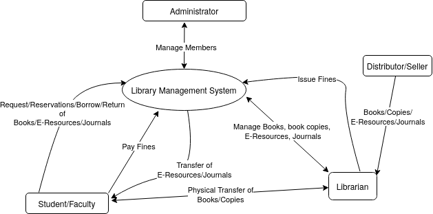
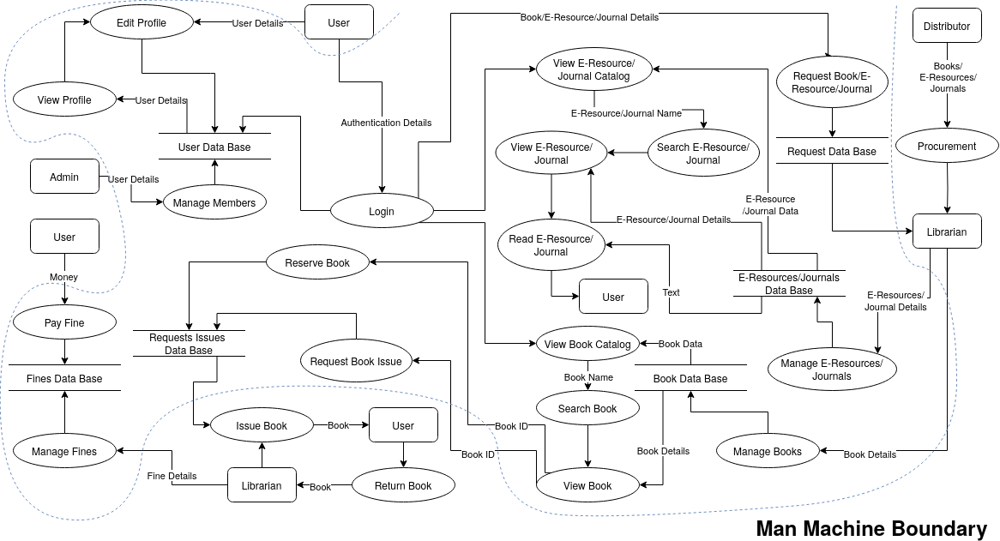
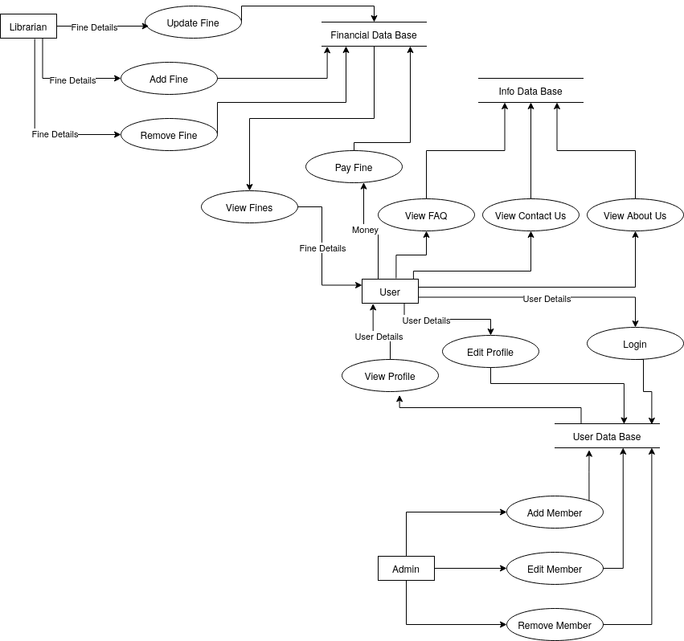
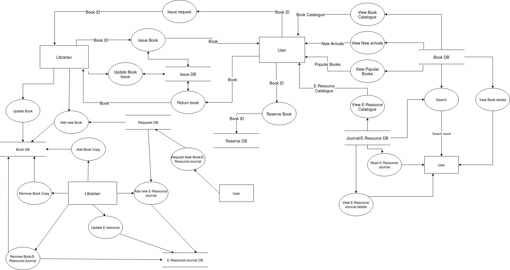

# Index

- [Index](#index)
- [Context Diagram](#context-diagram)
- [Data Flow Diagram(s)](#data-flow-diagrams)
  - [Data Flow Diagram: 1](#data-flow-diagram-1)
  - [Data Flow Diagram: 2](#data-flow-diagram-2)
  - [Comparison of the two data flow diagrams](#comparison-of-the-two-data-flow-diagrams)
- [Function Point Analysis](#function-point-analysis)
  - [Introduction](#introduction)
  - [Unadjusted Function Point Count](#unadjusted-function-point-count)
  - [Complexity Adjustment Factor](#complexity-adjustment-factor)
  - [Total Adjusted Function Point Count](#total-adjusted-function-point-count)
- [References](#references)

\newpage

# Context Diagram

This context diagram show an overview of the system. There are two main actors in the system: the librarian and the user.

The librarian is responsible for:

- Managing the library which includes managing the books/e-resources/journals, and fines.
- In the physical world, procuring new books, and managing the existing books and transferring them between the library and the users.
- In the digital world, managing the e-resources and journals, and managing the existing e-resources and journals and transferring them between the library and the users.

The admin is responsible for managing the users.

The user is responsible for:

- Request/Borrow/Return/Reserve books/e-resources/journals.
- Paying fines.
- In the physical world, transferring books between the library and the user.

\newpage

# Data Flow Diagram(s)

The below data flow diagrams show the flow of data in the system. The system is divided into two main parts: the physical world and the digital world. The physical world is the library and the digital world is the online library.

In the physical world, the librarian is responsible for managing the library which includes managing the books/e-resources/journals, and fines. The librarian is also responsible for procuring new books, and managing the existing books and transferring them between the library and the users.

In the digital world, the librarian is responsible for managing the e-resources and journals, and managing the existing e-resources and journals and transferring them between the library and the users. Also, the librarian is responsible for issuing fines to the users.

## Data Flow Diagram: 1

\newpage

## Data Flow Diagram: 2

\newpage

## Comparison of the two data flow diagrams

The first data flow diagram is correct because it shows the flow of data in the system. There is a clear distinction between the physical world and the digital world. From logging in to the system, searching for books/e-resources/journals, issuing a request, and paying fines, the data flow diagram shows the flow of data in the system.

The second data flow diagram is incorrect because:

- There is no clear distinction between the physical world and the digital world.
- It is just a list of actions that the user can perform in the system, since there is no clear data flow in the system.

In the first diagram, one can clear the multiple flows possible: After logging in, one can search for books, issue a request, pay fines, etc. or one can search for e-resources/journals, and then read them or instead request a new book/e-resource/journal. In the second diagram, there is no clear flow of data. It is just a list of actions that the user can perform in the system.

\newpage

# Function Point Analysis

## Introduction

Consider the following table for function point analysis:

| Function Type                 | Low Complexity | Average Complexity | High Complexity |
| ----------------------------- | -------------- | ------------------ | --------------- |
| Internal Logic Files(ILF)     | 7              | 10                 | 15              |
| External Interface Files(EIF) | 5              | 7                  | 10              |
| External Inputs(EI)           | 3              | 4                  | 6               |
| External Outputs(EO)          | 4              | 5                  | 7               |
| External Inquiries(EQ)        | 3              | 4                  | 6               |

## Unadjusted Function Point Count

Complexity of functions here is estimated based on the number of inputs, outputs, and the number of files. Experience of the team members is also taken into consideration.

| Function                                                  | Type | Complexity | FP  |
| --------------------------------------------------------- | ---- | ---------- | --- |
| Login                                                     | EI   | Average    | 4   |
| Logout                                                    | EI   | Low        | 3   |
| View Profile                                              | EQ   | High       | 6   |
| Edit Profile                                              | EI   | Average    | 4   |
| Add new Member                                            | EI   | Average    | 4   |
| Edit Member                                               | EI   | Average    | 4   |
| Delete Member                                             | EI   | Average    | 4   |
| Add a fine                                                | EI   | Average    | 4   |
| Edit a fine                                               | EI   | Average    | 4   |
| Delete a fine                                             | EI   | Low        | 3   |
| Pay a fine                                                | EI   | High       | 6   |
| View Fines                                                | EQ   | Low        | 3   |
| Add new book                                              | EI   | Average    | 4   |
| Edit a book                                               | EI   | Average    | 4   |
| Delete a book                                             | EI   | Average    | 4   |
| Add new book copy                                         | EI   | Low        | 3   |
| Remove a book copy                                        | EI   | Low        | 3   |
| Add new e-resource                                        | EI   | Average    | 4   |
| Edit an e-resource                                        | EI   | Average    | 4   |
| Delete an e-resource                                      | EI   | Average    | 4   |
| View Book Catalog                                         | EQ   | High       | 6   |
| View E-Resource Catalog                                   | EQ   | High       | 6   |
| Search for a book/E-Resource/Journal                      | EQ   | High       | 6   |
| View Book/E-Resource/Journal                              | EQ   | Average    | 4   |
| Request a book/E-Resource/Journal                         | EI   | High       | 6   |
| Reserve a book                                            | EI   | Average    | 4   |
| Request Issue a book                                      | EI   | Average    | 4   |
| Return a book                                             | EI   | Average    | 4   |
| Issue a book                                              | EI   | Average    | 4   |
| View All Issues/Requests/Returns/Reservations of a Member | EQ   | High       | 6   |
| View All Requests                                         | EQ   | Average    | 4   |
| Update Request                                            | EI   | Average    | 4   |
| View All Unresolved ssues/Requests/Returns/Reservations   | EQ   | High       | 6   |
| View FAQs                                                 | EQ   | Low        | 3   |
| View Contact Us                                           | EQ   | Low        | 3   |
| View About Us                                             | EQ   | Low        | 3   |
| Total                                                     | -    | -          | 152 |

| Extra Screen            | Type | Complexity | FP  |
| ----------------------- | ---- | ---------- | --- |
| Home                    | EO   | High       | 7   |
| Read E-Resource/Journal | EO   | High       | 7   |
| Forgot Password         | EO   | Average    | 5   |
| Total                   | -    | -          | 19  |

| Database                | Type | Complexity | FP  |
| ----------------------- | ---- | ---------- | --- |
| User Data               | ILF  | Low        | 7   |
| Book Data               | ILF  | Average    | 10  |
| E-Resource/Journal Data | ILF  | Average    | 10  |
| Fine Data               | ILF  | Low        | 7   |
| Request Data            | ILF  | Average    | 10  |
| Issue Data              | ILF  | Average    | 10  |
| Total                   | -    | -          | 54  |

| Integrations          | Type | Complexity | FP  |
| --------------------- | ---- | ---------- | --- |
| Payment Gateway       | EIF  | High       | 10  |
| GMails                | EIF  | Average    | 7   |
| Google Authentication | EIF  | Average    | 7   |
| Total                 | -    | -          | 24  |

Total Unadjusted Function Point Count(Total UFP): $\boxed{249}$

## Complexity Adjustment Factor

Complexity Adjustment Factor(CAF) = $0.65 + (0.01 * \sum^{i = 14}_{i = 1} F_i)$

where $F_i$ is the value adjusted for each of the 14 general system characteristics.

| General System Characteristics | Value |
| ------------------------------ | ----- |
| Data communications            | 1     |
| Distributed data processing    | 0     |
| Performance                    | 2     |
| Heavily used configuration     | 0     |
| Transaction role               | 2     |
| Online data entry              | 3     |
| End-user efficiency            | 1     |
| Online update                  | 2     |
| Complex processing             | 0     |
| Reusability                    | 1     |
| Installation ease              | 1     |
| Operational ease               | 2     |
| Multiple sites                 | 1     |
| Facilitate change              | 2     |
| Total                          | 18    |

Thus, CAF = $0.65 + (0.01 * \sum^{i = 14}_{i = 1} F_i)$ = $0.65 + 0.18 = 0.83$

## Total Adjusted Function Point Count

Total Adjusted Function Point Count(Total AFP) = Total UFP _ CAF = $249 _ 0.83 = 206.67 \approx \boxed{207}$

Considering that 1 FP = 50-60 LOC, the estimated LOC $= 207 * 50 \text{ to } 207 * 60 = 10350 \text{ to } 12420 \approx \boxed{\text{10000 to 12500 LOC}}$

\newpage

# References

Note that:

- The links below are clickable.
- The images used in this document are created using [draw.io](https://draw.io).

**References**:

- [Library Management System](https://en.wikipedia.org/wiki/Library_management_system)
- [Concepts of Function Point Analysis](http://www.functionpointmodeler.com/fpm-infocenter/index.jsp?topic=%2Fcom.functionpointmodeler.fpm.help%2Fditafiles%2Fconcepts%2Fcon-91.html)
